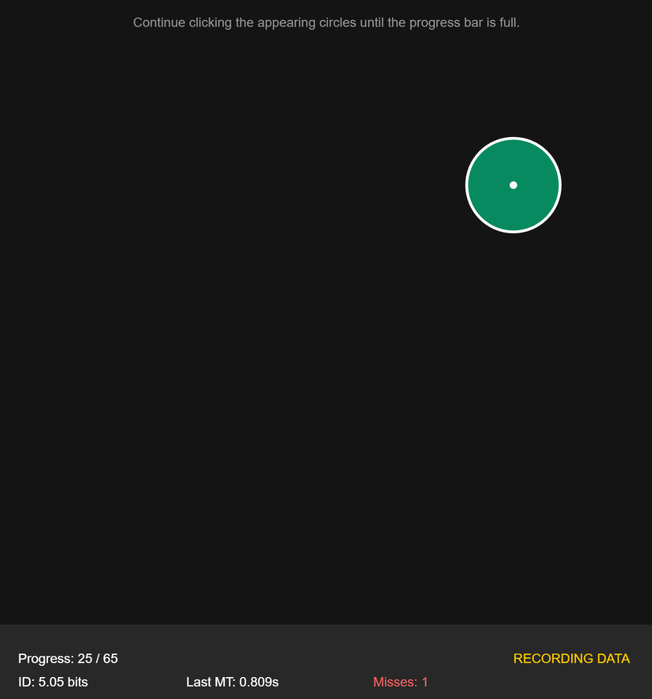
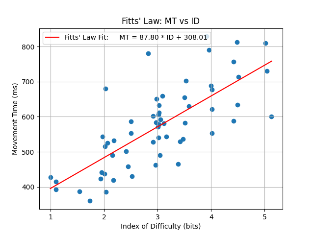
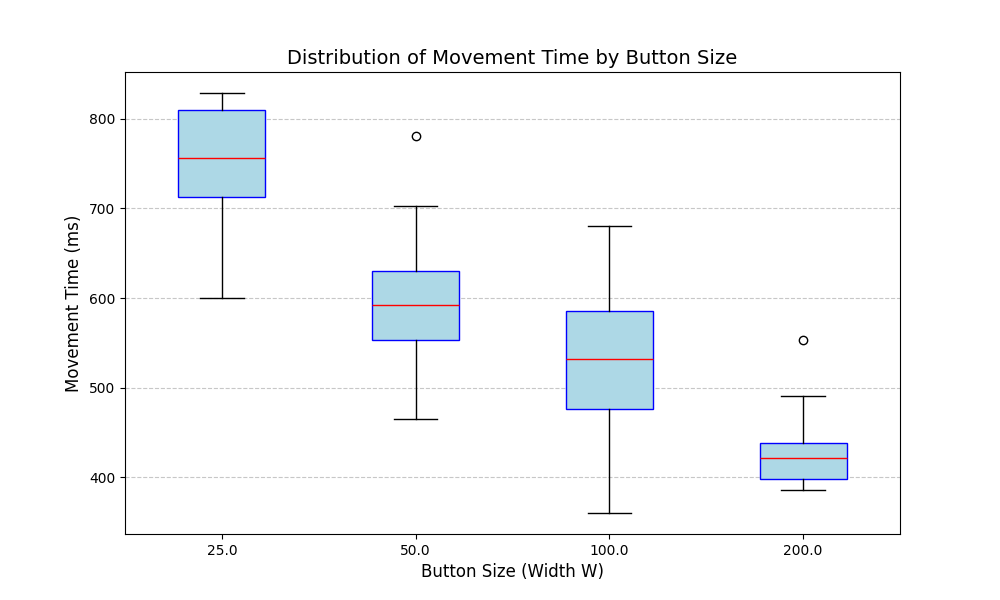
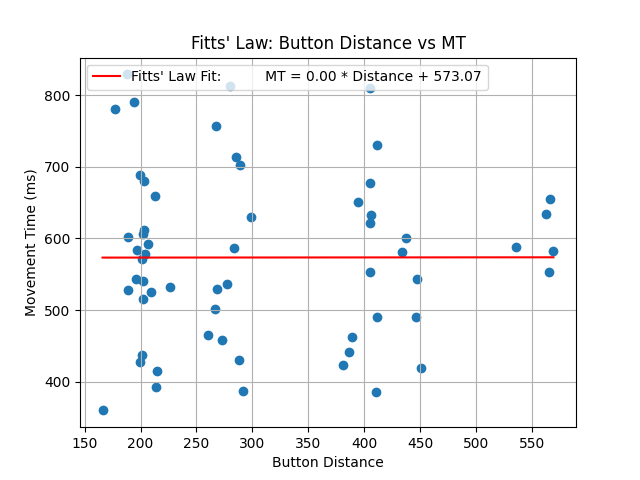
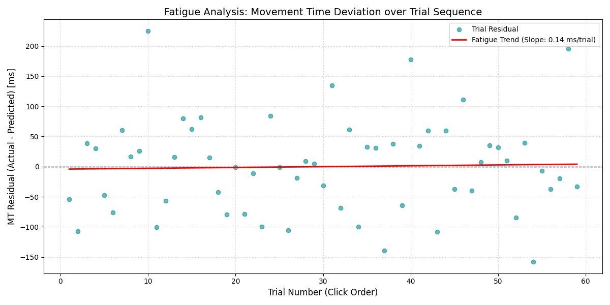

# Fitts' Law
This project implements an experiment to validate Fitts' Law: $MT = a + b \cdot \log_2(\frac{2D}{W} + 1)$. Using a p5.js interface, user interaction data (Movement Time, Distance, Target Width) to calculate the Index of Difficulty and perform linear regression to determine the constants: delay and acceleration

## 🕹️ The Experiment Interface

**[➔ Click here to launch the Interactive Data Collector](https://editor.p5js.org/codyviscardis/full/ggoWuNvm1)**

---

## Workflow

### Data Collection (p5.js)
1. Open the p5.js web editor link
2. The user clicks start and then clicks a target that programmatically changes in size and distance
3. Once the trials are completed, the user automatically triggers a download of "fitts_law_data.csv"

## Data Analysis (Python)
1. Move fitts_law_data into the /data directory of this repo
2. Run fitts_law.ipynb to process the logs, filter out "warm-up" trials, and generate the models

---

## Results and Analysis

### Fitts' Law Linear Regression
The chart below shows the linear relationship between the Index of Difficulty (ID) and Movement Time (MT).

### Fitts' Law Movement Time by Button Size
The chart below shows the impact of button size on user performance, independent of distance.

### Fitts' Law: Distance vs Movement Time
The chart below shows the relationship between the physical distance of the target and the time taken to click

### Fatigue Analysis
This chart showcases how movement time deviates over the length of the trial sequence

